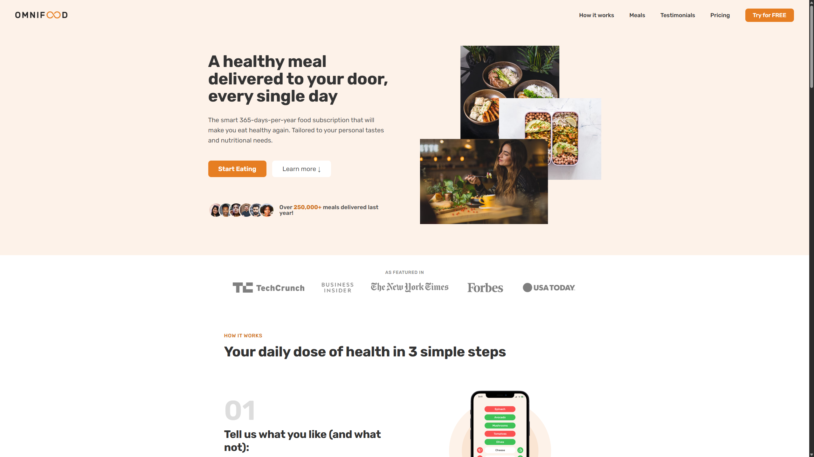
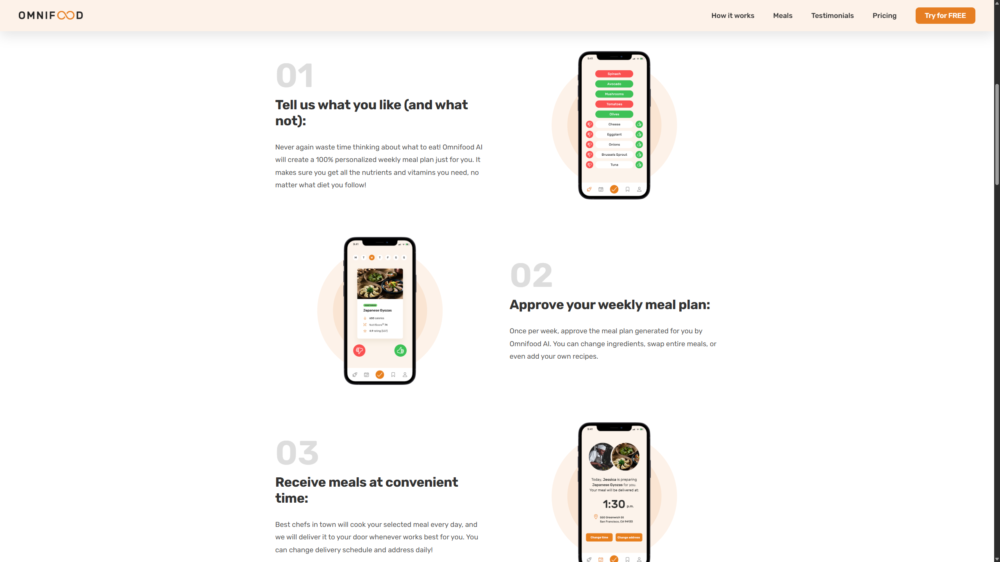
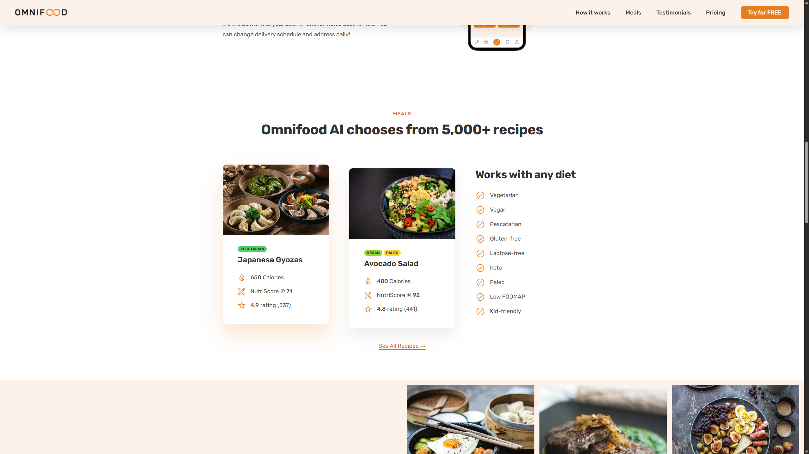
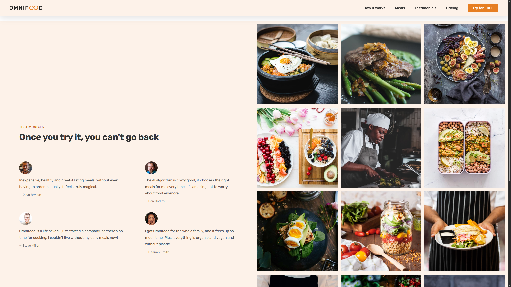
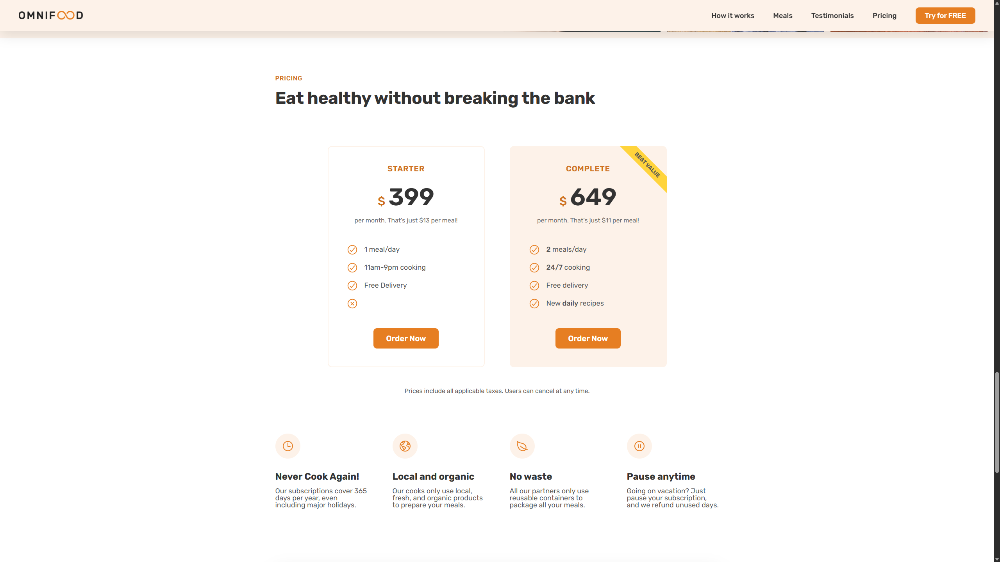
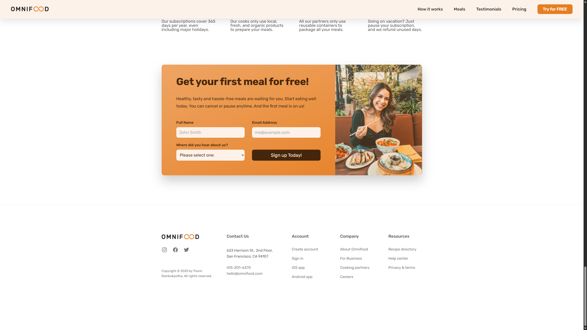

# 🚀 Learning HTML and CSS

### This project represents my hands-on journey in learning and applying core web development skills.
### Specifically with **_HTML_**, **_CSS_**, and a bit of **_JavaScript_**.

### 🌐 Live Demo
[Visit the Live Site](https://omnifood-trevin.netlify.app/)

---
## Tech Stack

- HTML5
- CSS3
- JavaScript 
- [Netlify](https://www.netlify.com/) for deployment
---

## Skills acquired
### 📄 HTML
- Deep understanding of HTML structure and elements
- Semantic sectioning using appropriate tags like  `<header>`, `<main>`, `<section>`, `<aside>`, `<footer>`

### 🎨 CSS
- Layout & styling following responsive and aesthetic web design principles
- Advanced styling effects, including:
    - Box shadows
    - Filters
    - Z-index layering
    - Transitions & animations
- CSS pseudo-classes:
    - `:hover`, `:active`, `:first-child`, `:last-child`, `:nth-child`

### 📦 Layout Techniques
- Float-based layout
- Flexbox
- CSS Grid

## Preview

## Acknowledgements

- Thanks to Jonas Schmedtmann on Udemy for the excellent course